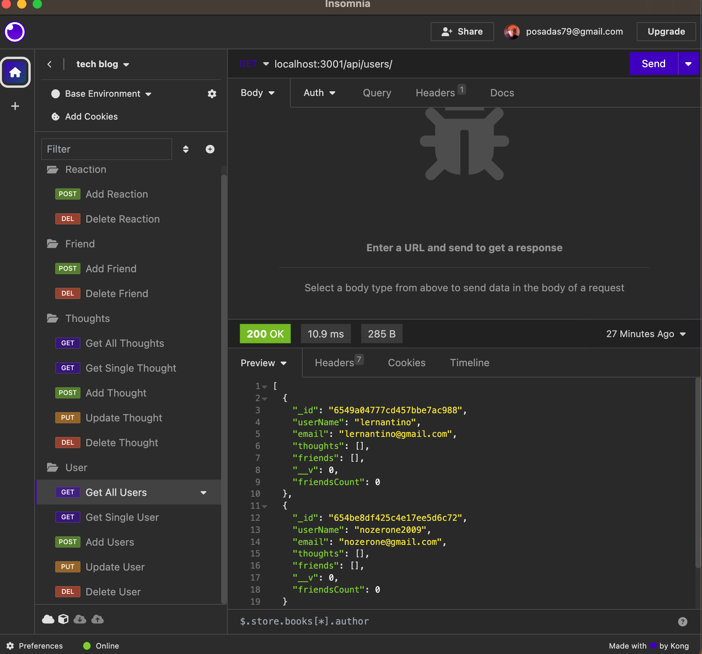
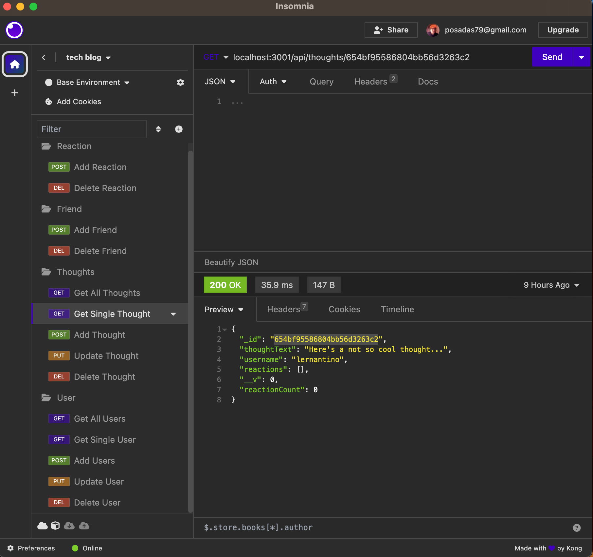
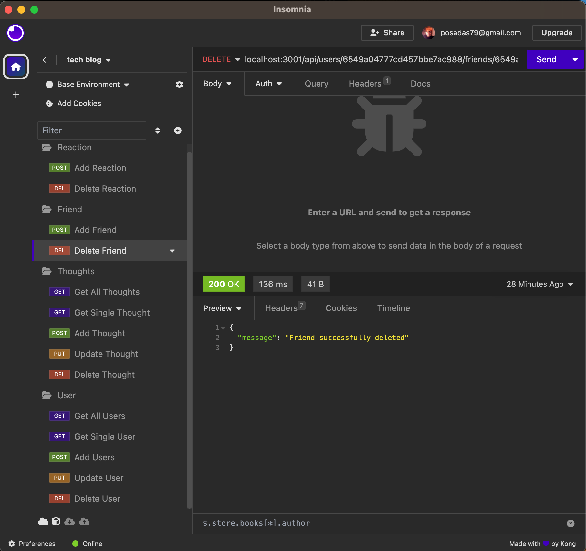

[License](https://img.shields.io/badge/license-OpenSource-blue)

# Social_Network!
18 NoSQL: Social Network API

   ## Description
   This challenge 18: NoSQL social network API.
   This web application where users can post and share thoughts, react to friend's thoughts and create a friend list. This app uses Express.js for routing, a MondoDB database and the Mongoose ODM.

   ## Table of Contents
   * [Installation](#installation)
   * [Usage](#usage)
   * [Contribute](#contribute)
   * [License](#license)
   * [Author](#author)
   * [gitHub](#github)
   * [Credits](#credits)
   * [Email](#email)
   * [Demo Video](#demo)
   
   
  ## Installation 
  This application requires the intallation npm packages, [Express.js](https://www.npmjs.com/package/express) and [Mongoose](https://www.npmjs.com/package/mongoose).

  ## Usage 
  Clone the app repo from github. Install npm dependencies. Install Express and Mongoose.

  ## Contribute 
  N/A
  ## License 
  This application is covered under OpenSource license.

  ## Project Author 
  Jose Posadas 

   ### gitHub 
   [nozerone](https://github.com/nozerone)

   ### Credits 
   N/A 

   ### Email 
   posadas79@gmail.com

   ### Repo app link
   [github repo] (https://github.com/Nozerone/Social_Network)

   ### App Screenshots
     
     
    

   ### Demo Video
   [Demo Video] (https://drive.google.com/file/d/1Dy2X_lm3yG5PfoGzGAptImqzeLsi8mtw/view)
